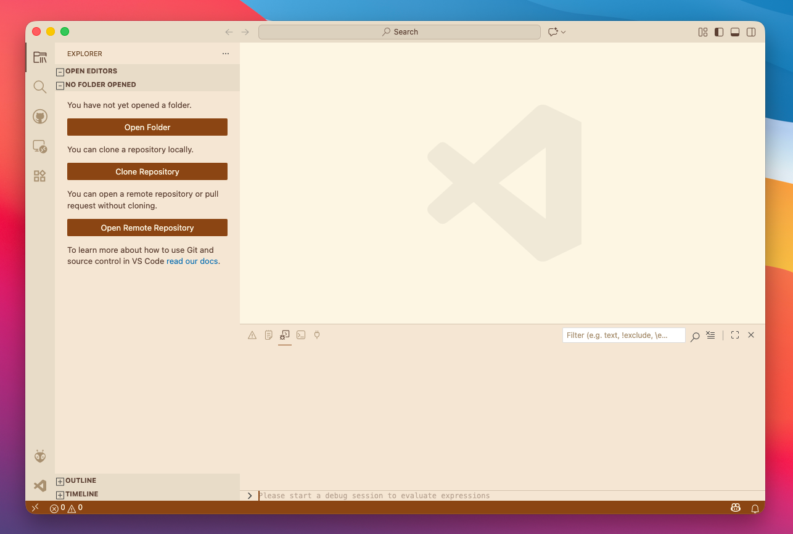

# Mocaccino Light

A warm, coffee-inspired light theme for VS Code.

## Preview

## Installation

1. Open **Extensions** in VS Code (`Cmd+Shift+X` / `Ctrl+Shift+X`)
2. Search for `Mocaccino Light`
3. Click **Install**
4. Go to **Preferences: Color Theme** and select **Mocaccino Light**

## Colors

| Element | Color |
|---------|-------|
| Background | Creamy off-white `#FAF4E8` |
| Text | Rich coffee brown `#6B5344` |
| Keywords | Warm brown `#9B6842` |
| Strings | Olive green `#7A9A5A` |
| Functions | Soft blue `#5A8AAA` |
| Classes | Muted gold `#A88A3A` |
| Types | Soft purple `#9A7ABB` |

## Features

- Easy on the eyes with warm, muted tones
- Full syntax highlighting support
- Styled UI elements (sidebar, tabs, status bar, terminal)
- Bracket pair colorization
- Git decoration colors
- Semantic highlighting support

## License

MIT
